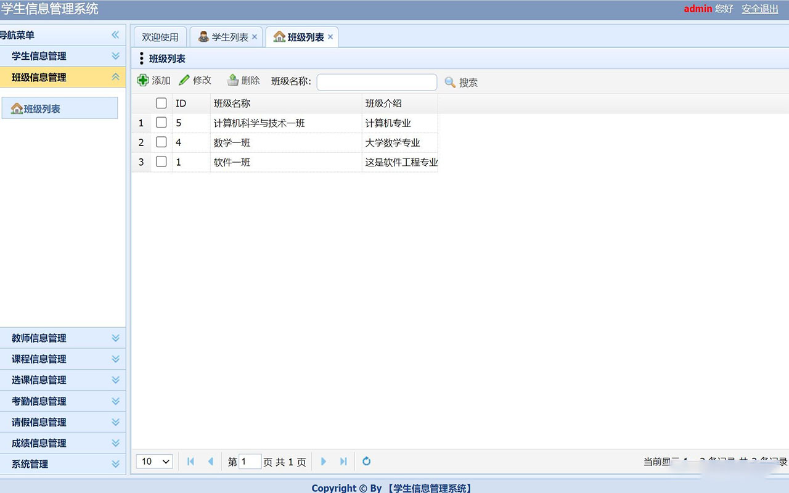
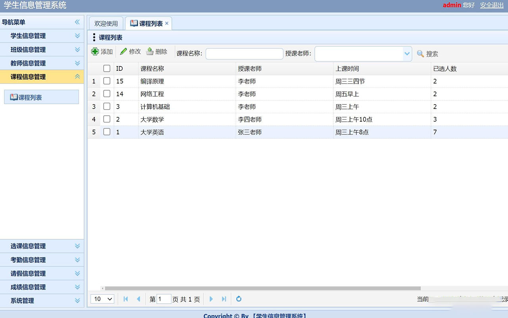
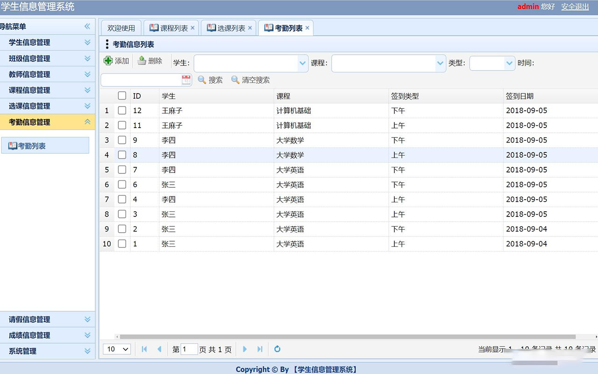
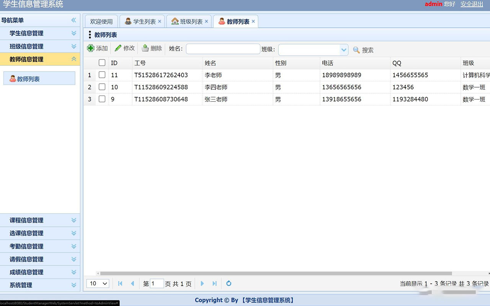
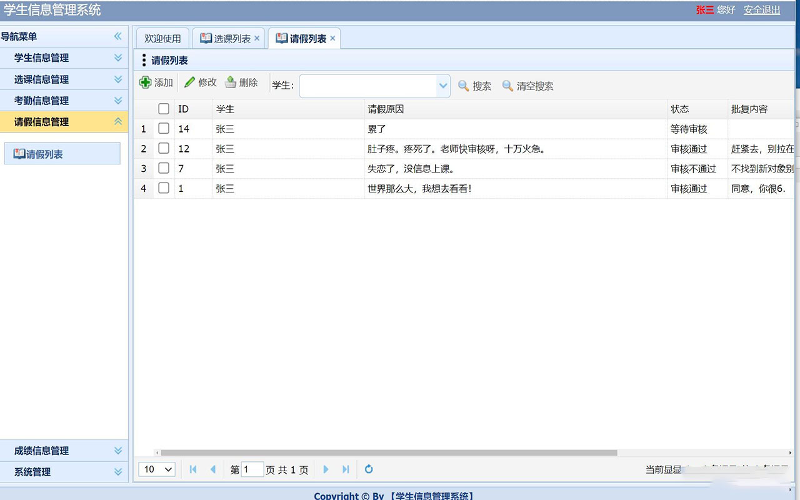
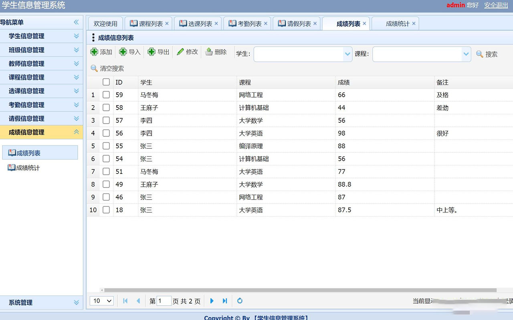
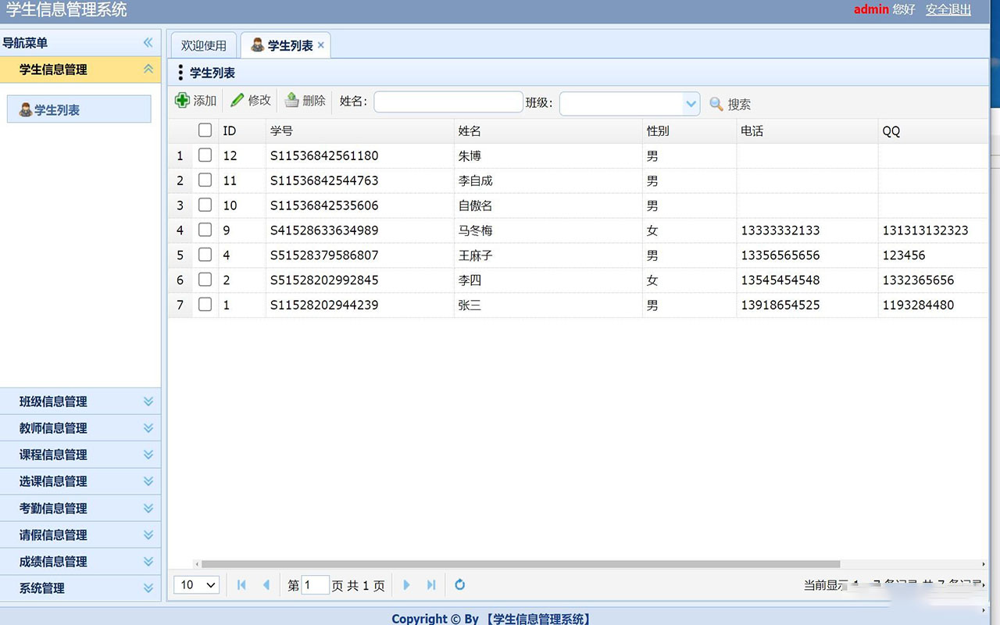
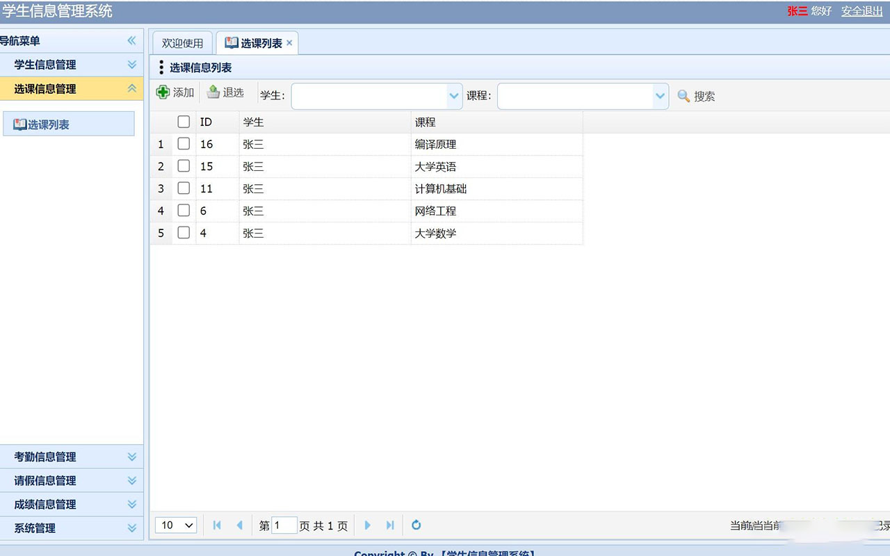
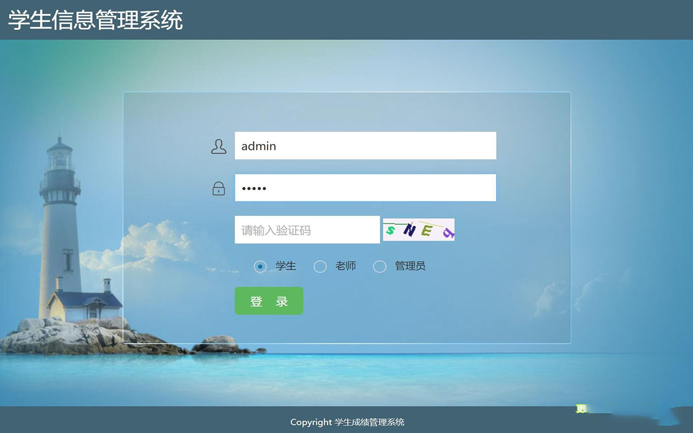
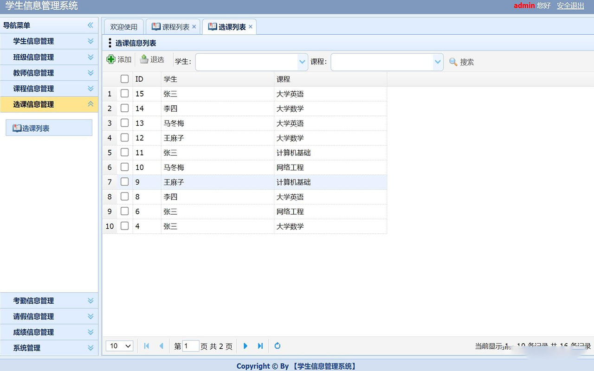

## 基于JSP+Servlet实现的学生信息管理系统

- <b>完整代码获取地址：从戎源码网 ([https://armycodes.com/](https://armycodes.com/))</b>
- <b>技术探讨、资料分享，请加QQ群：692619798</b> 
- <b>作者微信：19941326836  QQ：952045282</b> 
- <b>承接计算机毕业设计、Java毕业设计、Python毕业设计、深度学习、机器学习</b>
- <b>选题+开题报告+任务书+程序定制+安装调试+论文+答辩ppt 一条龙服务</b>
- <b>所有选题地址 ([https://github.com/YuLin-Coder/AllProjectCatalog](https://github.com/YuLin-Coder/AllProjectCatalog)) </b>

## 项目介绍
基于JSP+Servlet实现的学生信息管理系统，主要功能如下

【学生】
学生信息管理：学生列表
选课信息管理：选课列表
考勤信息管理：考勤列表
请假信息管理：请假列表
成绩信息管理：成绩列表
系统管理：修改密码

【管理员】
学生信息管理：学生列表
班级信息管理：班级列表
教师信息管理：教师列表
课程信息管理：课程列表
选课信息管理：选课列表
考勤信息管理：考勤列表
请假信息管理：请假列表
成绩信息管理：成绩列表，成绩统计
系统管理：修改密码

【老师】
学生信息管理：学生列表
班级信息管理：班级列表
教师信息管理：教师列表
课程信息管理：课程列表
选课信息管理：选课列表
考勤信息管理：考勤列表
请假信息管理：请假列表
成绩信息管理：成绩列表，成绩统计
系统管理：修改密码

## 项目技术
- 编程语言：Java
- 数据库：MySQL
- 前端技术：JSP、JavaScript、bootstrap、JQuery
- 后端技术：Servlet、JDBC

## 运行环境
- JDK版本：JDK1.8及以上
- 开发工具：IDEA、Ecplise、Myecplise都可以
- 数据库: MySQL5.7及以上

## 运行截图

